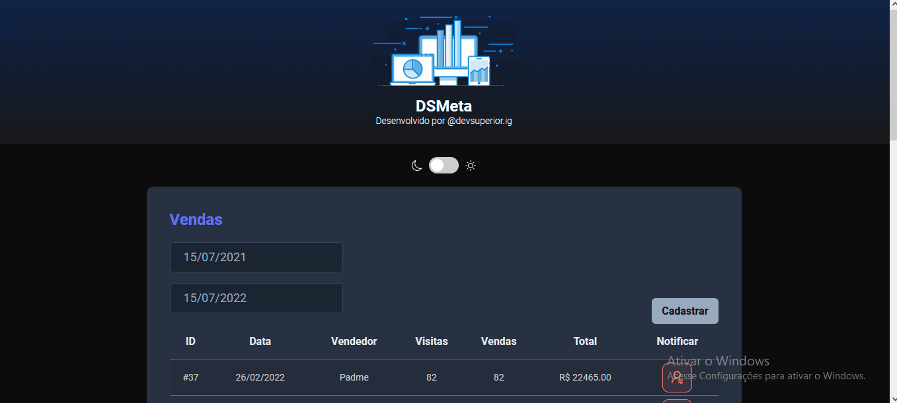
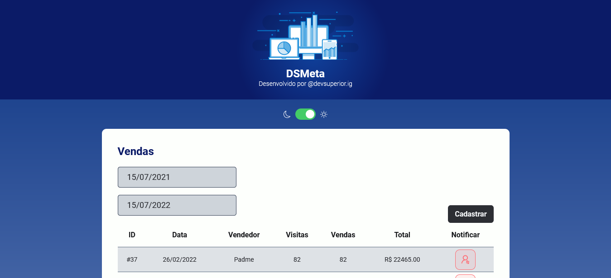
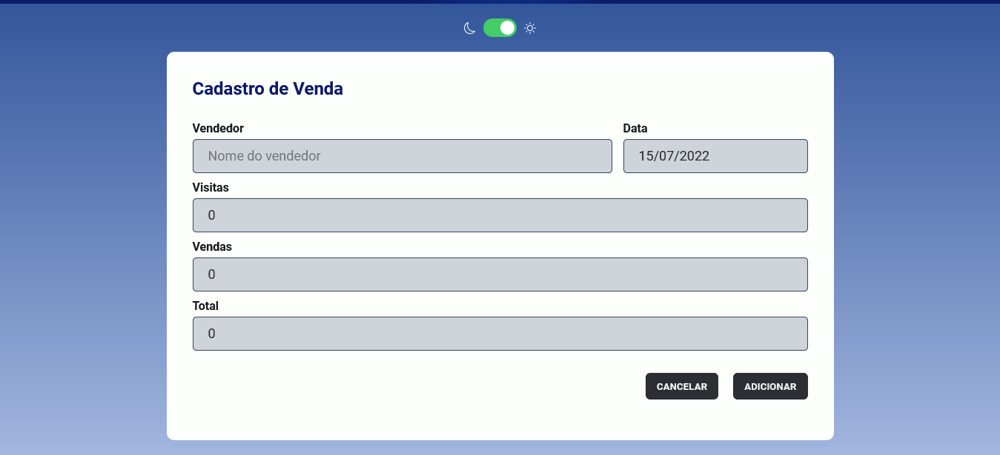

# :beginner: Projeto de Gerenciador de Vendas - DSMeta

Projeto construído na Semana Spring React 9.0, um evento realizado pelo DevSuperior.
A aplicação permite filtrar as vendas por data e enviar SMS por meio da integração com a API da Twilio. \
Adicionei a funcionalidade de cadastrar vendas e também dark mode.

Projeto no ar: :globe_with_meridians: [Link](https://dsmeta-sales-manager.vercel.app/)


## :hammer_and_wrench: Stack utilizada

**Front-end:** React, Typescript, SASS, Axios, Formik. 

**Back-end:** Java com Spring Boot.


## :movie_camera: Demonstração




## :camera_flash: Screenshots





## :gear: Rodando localmente

Clone o projeto

```bash
  git clone https://github.com/caducoder/dsmeta-SalesManager.git
```

Entre no diretório do projeto

```bash
  cd dsmeta-SalesManager
```

Abra a pasta `backend` na sua IDE preferida e inicie a aplicação.

Entre na pasta `frontend` e instale as dependências

```bash
  npm install
```

Inicie o front

```bash
  npm run dev
```


